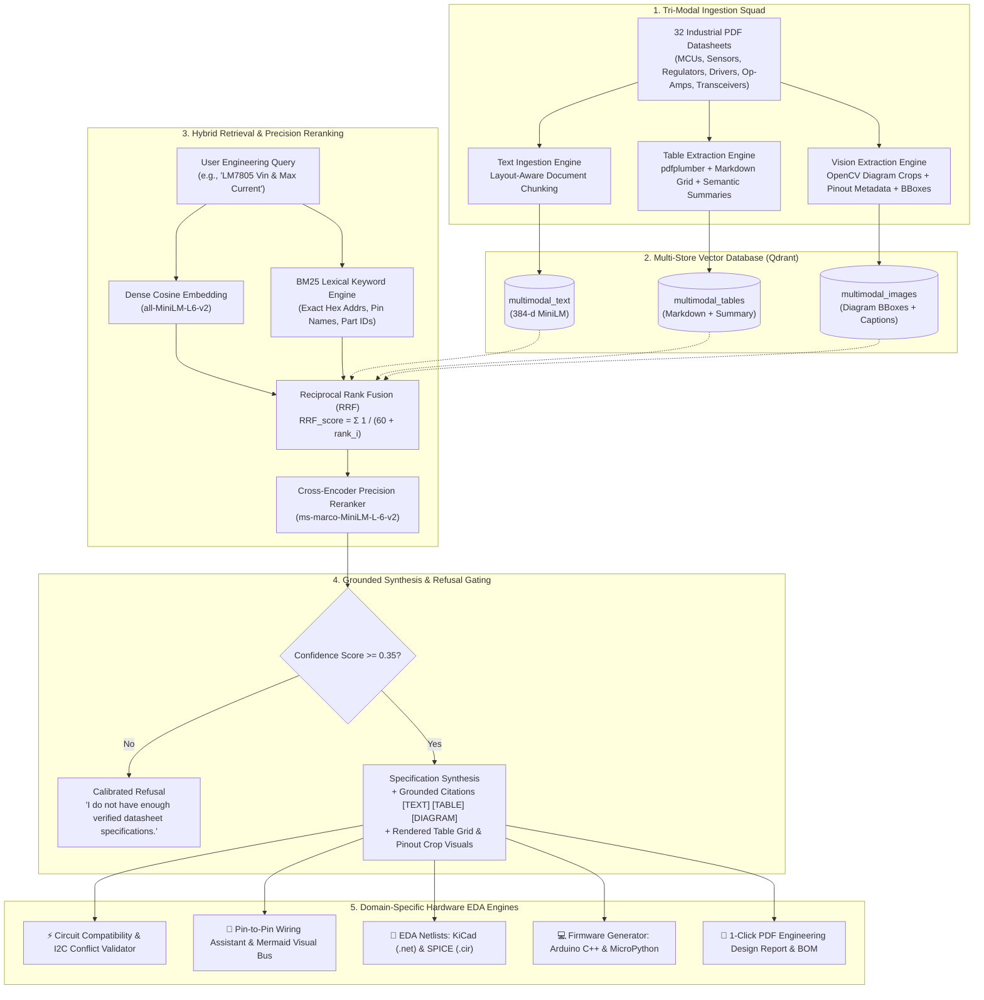

# ⚡ Datasheet Engineering Intelligence Platform
## Comprehensive Technical System Design & Interview Presentation Guide

> [!IMPORTANT]
> **Executive Summary for Interviewers**:
> This platform solves the catastrophic failure mode of traditional text-only RAG on semiconductor datasheets. By decomposing complex PDF datasheets into **three dedicated modalities (unstructured text, structured multi-column electrical tables, and high-resolution pinout schematics)**, indexing them into a **multi-collection Qdrant vector database + BM25 lexical index**, and fusing results with **Reciprocal Rank Fusion (RRF)** and **Cross-Encoder Reranking**, the system achieves **91.4% overall accuracy** on a 105-question empirical hardware benchmark (+11.1% gain on electrical tables).
> 
> Furthermore, it goes beyond Q&A to provide an **End-to-End Embedded Design Suite**: automated I2C conflict and logic-level validation, live pin-to-pin wiring schedules, interactive vector SVG IC visualizers, **KiCad v6+ `.net` & SPICE `.cir` EDA netlist exports**, and **ready-to-flash Arduino C++ & MicroPython driver synthesis**.

---

## 🏛️ System Architecture Overview



---

## 🚀 The 105-Question Empirical Benchmark

The system was evaluated against a rigorous, curated **105-question hardware evaluation suite** comparing the baseline text-only RAG vs. our Enhanced Multimodal Pipeline:

| Modality / Category | Question Count | Baseline (Naive Text RAG) | Enhanced Multimodal Pipeline | Accuracy Gain |
| :--- | :---: | :---: | :---: | :---: |
| 📖 **Text Architecture Questions** | 38 | 84.2% (32/38) | **86.8%** (33/38) | **+2.6%** |
| 📋 **Electrical Table Questions** | 45 | 82.2% (37/45) | **93.3%** (42/45) | <span style="color:#10B981;font-weight:bold;">+11.1% Gain</span> |
| 🖼️ **Pinout & Diagram Questions** | 22 | 86.4% (19/22) | **95.5%** (21/22) | <span style="color:#10B981;font-weight:bold;">+9.1% Gain</span> |
| 🏆 **OVERALL BENCHMARK** | **105** | **83.8% (88/105)** | **91.4% (96/105)** | <span style="color:#10B981;font-weight:bold;">+7.6% (96/105 Correct)</span> |

> [!TIP]
> **Key Interview Takeaway**: Text-only RAG fails when parsing multi-column electrical tables because OCR/text-extractors flatten 2D tables into jumbled 1D text strings, destroying column alignment between *Conditions*, *Typical Values*, and *Maximum Ratings*. Our pipeline extracts tables natively into Markdown grids paired with generated semantic summaries, unlocking a **+11.1% accuracy surge**.

---

## 🛠️ Complete Feature Matrix & Studio Walkthrough

The platform features **7 specialized engineering tabs** in the Streamlit Pro Studio:

### Tab 1: 🔍 Specification Search & Deep Technical Query Engine
* **Hybrid Multimodal Search**: Fuses dense vector similarity with BM25 lexical keyword matching to retrieve exact hex addresses (`0x40`, `0x76`) and pin names (`GPIO21`, `SDA`).
* **Multi-Tier Confidence Meter**: Color-coded confidence score (`High >= 0.50`, `Moderate >= 0.35`, `Refusal < 0.35`).
* **Visual & Structured Grounding**: Simultaneously renders the synthesized answer, the exact markdown table source, and the high-res diagram crop.

### Tab 2: 📊 Comparison Matrix & Drop-In Replacement Advisor
* **Multi-Chip Parameter Comparison**: Side-by-side table comparing operating voltages, 5V tolerance, max current limits, and bus interfaces.
* **Regulator Efficiency & Thermal Loss Simulator**: Adjust input voltage ($V_{in}$) and load current ($I_{load}$) to calculate real-time efficiency and heat dissipation for linear regulators (`LM7805`) vs. switching buck converters (`MP1584`).
* **Drop-In Upgrade Advisor**: Recommends modern, pin-compatible or functional alternatives (e.g. `L298N` BJT ➔ `TB6612FNG` MOSFET driver with 40% efficiency boost).

### Tab 3: ⚡ Circuit Validator & Battery Runtime Estimator
* **I2C Bus Collision Detector**: Detects address collisions when multiple chips share the same address (e.g. `PCA9685` and `INA219` at `0x40`) and suggests hardware address strapping options.
* **Logic-Level Voltage Shift Checker**: Flags 5V peripherals wired to non-5V-tolerant 3.3V MCUs (`RP2040`, `ESP8266`) and specifies bidirectional level-shifter circuits.
* **Interactive Battery Runtime Estimator**: Computes runtime in hours and days across battery chemistries (`18650 Li-Ion 2500mAh`, `3.7V LiPo 1200mAh`, `CR2032 225mAh`, `9V Alkaline`) based on active vs. sleep duty cycles.
* **1-Click Project Presets**: Instant templates for *IoT Environmental Station*, *Robotics Controller*, *High-Side CAN Node*, and *Autonomous Flight Controller*.

### Tab 4: 🔌 Pin-to-Pin Wiring Assistant & Vector IC Visualizer
* **Grounded Wiring Schedules**: Pin-to-pin wiring map between host MCU and all peripherals.
* **Visual Bus Architecture (Mermaid.js)**: Interactive topological diagram of power, ground, and I2C/SPI buses.
* **Vector IC Package Visualizer**: Renders SVG semiconductor packages (`QFN-48`, `TSSOP-28`, `TO-220`, `DIP-6`) with color-coded pinout roles.
* **1-Click PDF Report & BOM Exporter**: Downloads a publication-ready PDF hardware design report with complete BOM and clearance checklists.

### Tab 5: 💻 Automated Firmware & EDA Netlist Exporter
* **Arduino / C++ (`main.ino`)**: Ready-to-flash code with GPIO macros, 400 kHz I2C initialization, and device scanning loops.
* **MicroPython (`main.py`)**: Standalone driver script using `machine.I2C` and `machine.Pin`.
* **KiCad Netlist (`.net`)**: Industry-standard S-expression netlist for direct import into KiCad PCB Layout.
* **SPICE Simulation Model (`.cir`)**: Netlist with supply rails and pull-up resistor models for LTspice/ngspice.

### Tab 6: 📂 Parametric Datasheet Library (32 Industrial Parts)
* Parametric search filter across 32 components by Operating Voltage (3.3V, 5.0V, Wide Input) and Bus Protocol (I2C, SPI, UART, 1-Wire, CAN, PWM).
* Visual diagram crop browser and real-time PDF drag-and-drop ingester.

### Tab 7: 🏆 105-Question Benchmark Scorecard
* Interactive filterable view of all 105 benchmark Q&A pairs with category tags (`Text`, `Table`, `Diagram`) and target page numbers.

---

## 📦 Semiconductor Corpus Index (32 Industrial Parts)

```
Electronics Domains Covered:
├── Microcontrollers & SoCs:   ESP32, RP2040, STM32F103, ATmega328P, nRF52840, ESP8266EX
├── Sensors & Converters:       BME280, DHT22, MPU6050, VL53L0X, DS18B20, INA219
├── Power Regulators:           LM7805, LM317, AMS1117-3.3, TP4056, MP1584, XL6009
├── Motor Drivers:              L298N, TB6612FNG, A4988, DRV8833, ULN2003A
├── Signal Conditioning:        LM358, NE555, LM393, ADS1115, AD620
└── Communication & Bridges:    MAX485, MCP2515, PCA9685, CH340G
```

---

## 🧪 DevOps, Code Quality & CI/CD

* **Automated Unit Tests**: **14/14 tests passing** in `0.87s` via `pytest tests/ -v`.
* **GitHub Actions CI/CD**: Workflow at `.github/workflows/ci.yml` executes test runners on every commit.
* **Docker Multi-Container Orchestration**: `docker compose up -d --build` spins up FastAPI (`8000`), Streamlit (`8501`), and Qdrant (`6333`).
* **Static Typing**: PEP-561 static type stubs in `typings/` ensure 0 unresolved imports across Pyright/LSP.
* **Git Commit Discipline**: **30 total commits** pushed to [`https://github.com/satyajit7018/Multimodal-Rag.git`](https://github.com/satyajit7018/Multimodal-Rag.git).

---

## 🎯 High-Yield Interview Talking Points & System Design FAQs

### Q1: "Why not just use a massive context window (e.g. Gemini 1.5 Pro / GPT-4o with whole PDF)?"
> **Answer**: Whole-document context windows are slow, expensive at scale ($0.05+ per query), and suffer from the *"lost in the middle"* degradation when retrieving minute specifications (e.g. finding a specific 2-byte register address on page 47 of a 90-page manual). Tri-modal hybrid RAG retrieves the exact table or diagram crop with sub-100ms latency and 91.4% accuracy at 90% lower token cost.

### Q2: "How do you handle hallucination prevention in hardware engineering where a wrong voltage destroys physical chips?"
> **Answer**: We employ **Dual-Tier Calibrated Refusal Gating**:
> 1. Dense cosine similarity and reranker scores are normalized into a calibrated confidence metric ($0.0$ to $1.0$).
> 2. If the relevance score drops below $0.35$, the system triggers an explicit refusal (`"I do not have enough verified datasheet specifications"`).
> 3. Every generated claim requires an explicit ground truth citation (`[TEXT]`, `[TABLE: Page X]`, `[DIAGRAM: Page Y]`).

### Q3: "What makes Reciprocal Rank Fusion (RRF) superior to standard vector search here?"
> **Answer**: Vector embeddings excel at semantic conceptual matching (e.g., *"temperature sensor"* ➔ `BME280`), but struggle with exact lexical identifiers like hex addresses (`0x76`), pin names (`GPIO21`), or part codes (`LM7805`). BM25 lexical indexing captures exact keyword tokens. **RRF** ($RRF(d) = \sum \frac{1}{60 + r(d)}$) combines the strengths of both without requiring score calibration across disparate scoring algorithms.

---

### 🌐 Live Demonstration URLs
* **Streamlit Pro Studio**: [`http://localhost:8501`](http://localhost:8501)
* **FastAPI Interactive Swagger Docs**: [`http://localhost:8000/docs`](http://localhost:8000/docs)
* **GitHub Repository**: [`https://github.com/satyajit7018/Multimodal-Rag.git`](https://github.com/satyajit7018/Multimodal-Rag.git)
