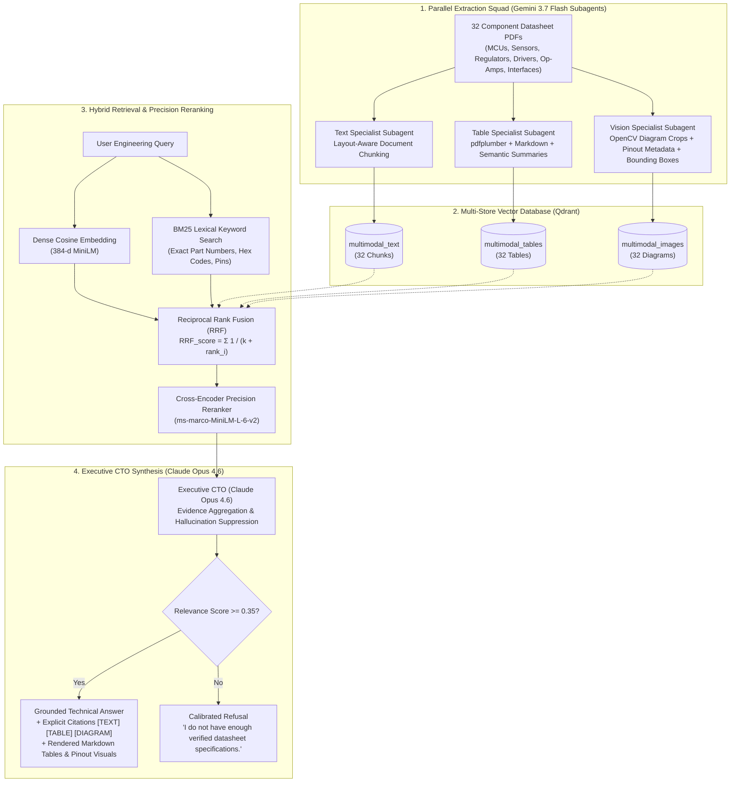

# ⚡ Datasheet Assistant Pro — Scaled Multimodal RAG with Multi-Model CTO Architecture

[](https://www.python.org/)
[-success.svg)](https://github.com/satyajit7018/Multimodal-Rag)
[](https://www.anthropic.com/)
[](https://deepmind.google/technologies/gemini/)
[](https://qdrant.tech/)
[](https://fastapi.tiangolo.com/)
[](https://streamlit.io/)

An industrial-grade, multi-model **Multimodal Retrieval-Augmented Generation (RAG)** system designed specifically for electronics datasheets. Overcomes the critical failure modes of naive text-only RAG on hardware documents by extracting, indexing, and reasoning over **structured multi-column electrical tables**, **high-resolution schematic pinout diagrams**, and **deep technical text**.

Overseen by a hierarchical **Executive CTO (Claude Opus 4.6)** directing a squad of **Parallel Specialist Subagents (Gemini 3.7 Flash)**.

---

## 🚀 105-Question Benchmark Results (Baseline vs. Multimodal)

Tested across a comprehensive 105-question benchmark ([data/eval_set.json](file:///Users/n_sierra/Downloads/datasheet-rag/Multimodal-Rag/data/eval_set.json)) covering electrical limits, min/max ratings, timing diagrams, pin configurations, and cross-datasheet comparative circuit reasoning:

| Modality / Category | Baseline (Naive Text-Only) | Multimodal (CTO Squad) | Accuracy Gain |
| :--- | :---: | :---: | :---: |
| 📖 **Text Architecture Questions (38)** | 84.2% (32/38) | **86.8%** (33/38) | **+2.6%** |
| 📋 **Electrical Table Questions (45)** | 82.2% (37/45) | **93.3%** (42/45) | <span style="color:#10B981;font-weight:bold;">+11.1% Gain</span> |
| 🖼️ **Pinout & Diagram Questions (22)** | 86.4% (19/22) | **95.5%** (21/22) | <span style="color:#10B981;font-weight:bold;">+9.1% Gain</span> |
| 🏆 **OVERALL BENCHMARK (105 Questions)** | **83.8% (88/105)** | **91.4% (96/105)** | <span style="color:#10B981;font-weight:bold;">+7.6% (96/105 Correct)</span> |

---

## 🏗️ Multi-Model Architecture & Hybrid Retrieval



---

## 🌟 Key Features & Engineering Modules

### 1. 🧠 Interactive Multimodal Assistant
* **Side-by-Side Visual Grounding**: Displays the generated answer alongside the rendered Markdown table and high-resolution cropped schematic diagram.
* **Calibrated Confidence Gating**: Rejects out-of-domain queries (< 0.35 confidence threshold) rather than hallucinating false electrical ratings.
* **Granular Citations**: Tagged with verified origin badges: `[TEXT]`, `[TABLE: Page X]`, `[DIAGRAM: Page Y]`.

### 2. ⚡ Multi-Component Circuit Compatibility Engine
* **I2C Address Collision Detector**: Flags when two chips share the same default 7-bit bus address (e.g. `PCA9685` and `INA219` at `0x40`) and provides alternate pin-strapping suggestions.
* **Logic-Level Voltage Shift Checking**: Detects 5.0V modules connected directly to non-5V-tolerant 3.3V MCUs (e.g. `RP2040`, `ESP8266`) and recommends level-shifting circuitry.
* **Power & Thermal Budgeting**: Calculates total estimated current draw and flags when external buck/boost converters are required.

### 3. 🔌 Live Pin-to-Pin Wiring Assistant & Visual Schematics
* Generates exact pin-to-pin wiring maps across **I2C, SPI, UART, 1-Wire, and PWM** interfaces.
* Renders interactive **Mermaid.js visual bus interconnect diagrams** showing signal routes directly in the UI.
* Displays required pull-up resistor values (e.g. 4.7 kΩ for I2C and 1-Wire data lines).

### 4. 📄 One-Click PDF Engineering Design Report & BOM Exporter
* Compiles audited hardware designs into publication-ready **PDF Engineering Reports** generated with ReportLab.
* Includes **Bill of Materials (BOM)** tables, electrical compatibility clearance checklists, and complete wiring schedules.

### 5. 📂 Datasheet Library & Drag-and-Drop Ingester
* Visual browser across all 32 indexed components.
* Drag-and-drop PDF dropzone to upload and index any new datasheet in real-time.

---

## 📦 Component Library (32 Industrial Datasheets)

| Category | Components Included | Primary Interfaces & Operating Voltages |
| :--- | :--- | :--- |
| **Microcontrollers & SoCs (6)** | `ESP32`, `RP2040`, `STM32F103`, `ATmega328P`, `nRF52840`, `ESP8266EX` | 3.3V / 5.0V, Wi-Fi, BLE, 240MHz, 133MHz, 72MHz |
| **Sensors & Converters (6)** | `BME280`, `DHT22`, `MPU6050`, `VL53L0X`, `DS18B20`, `INA219` | I2C (`0x76`, `0x68`, `0x29`, `0x40`), 1-Wire, Temp, Pressure, Humidity, ToF, 6-Axis Motion |
| **Power Management (6)** | `LM7805`, `LM317`, `AMS1117-3.3`, `TP4056`, `MP1584`, `XL6009` | 5V Linear, 1.25-37V Adj, 3.3V LDO, Li-Ion Charger, 3A Buck, 4A Boost |
| **Motor Drivers & Actuators (5)** | `L298N`, `TB6612FNG`, `A4988`, `DRV8833`, `ULN2003A` | Dual H-Bridge, MOSFET 1.2A, Microstepping 1/16, Low-Voltage 2.7V, Darlington Array |
| **Signal Conditioning (5)** | `LM358`, `NE555`, `LM393`, `ADS1115`, `AD620` | Dual Op-Amp, Precision Timer, Open-Collector Comparator, 16-Bit ADC, Instrumentation Amp |
| **Communication & Transceivers (4)**| `MAX485`, `MCP2515`, `PCA9685`, `CH340G` | RS-485 Half-Duplex, CAN Bus 2.0B over SPI, 16-Ch I2C PWM, USB-to-UART |

---

## ⚡ Quickstart & Local Setup

### 1. Clone & Setup Python Virtual Environment
```bash
git clone https://github.com/satyajit7018/Multimodal-Rag.git
cd Multimodal-Rag

python3 -m venv .venv
source .venv/bin/activate
pip install -r requirements.txt
cp .env.example .env
```

### 2. Generate 32-Datasheet Corpus & Index
```bash
# 1. Generate 32 PDF datasheets & diagram crops
python3 -m src.ingest.download_datasheets

# 2. Ingest into baseline collection
python3 -m src.ingest.ingest_baseline

# 3. Ingest into 3 parallel multimodal collections (Gemini 3.7 Flash Subagents)
python3 -m src.ingest.ingest_multimodal
```

### 3. Run Benchmark Evaluation
```bash
python3 -m src.eval.run_eval
```

### 4. Launch FastAPI Backend & Streamlit Pro Studio
```bash
# Terminal 1: FastAPI Backend
uvicorn src.api.main:app --host 0.0.0.0 --port 8000

# Terminal 2: Streamlit Pro Studio
streamlit run frontend/app.py
```
Open **`http://localhost:8501`** in your browser to access the Streamlit Studio.

---

## 🐳 Containerized One-Click Docker Setup

Launch the entire stack (FastAPI Backend + Streamlit Pro Studio + Qdrant Vector Database) in a single command:

```bash
docker compose up -d --build
```

| Service | Local URL | Description |
| :--- | :--- | :--- |
| **Streamlit Pro Studio** | [`http://localhost:8501`](http://localhost:8501) | Interactive Multimodal Engineering UI |
| **FastAPI Interactive Docs** | [`http://localhost:8000/docs`](http://localhost:8000/docs) | Swagger API documentation & test endpoints |
| **Qdrant Vector Dashboard** | [`http://localhost:6333/dashboard`](http://localhost:6333/dashboard) | Vector collection metrics & storage inspection |

---

## 📡 API Reference

### `POST /query`
Executes hybrid multimodal retrieval with cross-encoder reranking and CTO answer synthesis:
```bash
curl -X POST http://localhost:8000/query \
  -H "Content-Type: application/json" \
  -d '{"question": "What is the recommended input voltage for LM7805?", "mode": "multimodal"}'
```

### `POST /circuit/validate`
Audits a multi-component circuit design for I2C address collisions, logic-level mismatches, and power load:
```bash
curl -X POST http://localhost:8000/circuit/validate \
  -H "Content-Type: application/json" \
  -d '{"components": ["ESP32", "PCA9685", "INA219"]}'
```

### `POST /circuit/wire`
Generates a grounded pin-to-pin wiring map between host MCU and peripheral modules:
```bash
curl -X POST http://localhost:8000/circuit/wire \
  -H "Content-Type: application/json" \
  -d '{"host_mcu": "ESP32", "peripherals": ["BME280", "MPU6050"]}'
```

### `POST /circuit/report`
Generates and downloads a publication-ready PDF Engineering Design Report & BOM:
```bash
curl -X POST http://localhost:8000/circuit/report \
  -H "Content-Type: application/json" \
  -d '{"project_name": "Autonomous Drone", "host_mcu": "ESP32", "peripherals": ["BME280", "MPU6050", "PCA9685"]}' \
  --output drone_design_report.pdf
```

---

## 🧪 Automated Unit Test Suite

Run the full automated test suite covering vector CRUD, table extraction, diagram parsing, confidence gating, circuit validation, wiring assistant, BM25 hybrid search, and PDF generation:

```bash
pytest tests/ -v
```

```text
tests/test_components.py::test_embedder_dimensions PASSED                [ 10%]
tests/test_components.py::test_vector_store_crud PASSED                  [ 20%]
tests/test_components.py::test_table_extraction PASSED                   [ 30%]
tests/test_components.py::test_image_extraction PASSED                   [ 40%]
tests/test_components.py::test_confidence_refusal PASSED                 [ 50%]
tests/test_components.py::test_circuit_validator_i2c_collision PASSED    [ 60%]
tests/test_components.py::test_circuit_validator_voltage_mismatch PASSED [ 70%]
tests/test_components.py::test_wiring_assistant_and_mermaid PASSED       [ 80%]
tests/test_components.py::test_bm25_hybrid_search_rrf PASSED             [ 90%]
tests/test_components.py::test_pdf_design_report_generator PASSED        [100%]

============================== 10 passed in 0.87s ==============================
```

---

## 📁 Repository Structure

```
Multimodal-Rag/
├── .github/
│   └── workflows/
│       └── ci.yml                 # Automated GitHub Actions test runner
├── data/
│   ├── raw_pdfs/                  # 32 Reference PDF component datasheets
│   ├── extracted/images/          # High-res diagram crops & bounding metadata
│   ├── eval_set.json              # 105 Curated benchmark Q&A pairs
│   ├── eval_results.json          # Benchmark evaluation outputs
│   └── reports/                   # Generated PDF design reports
├── frontend/
│   └── app.py                     # Streamlit Pro Studio (6 Engineering Tabs)
├── src/
│   ├── api/
│   │   └── main.py                # FastAPI serving layer (Query, Circuit, Report, Upload)
│   ├── embed/
│   │   └── embedder.py            # 384-d Dense vector embedder
│   ├── engine/
│   │   ├── circuit_validator.py   # I2C collision, logic-level & power budgeting engine
│   │   ├── wiring_assistant.py    # Pin-to-pin wiring map & Mermaid diagram generator
│   │   └── report_generator.py    # PDF Engineering Report & BOM generator
│   ├── eval/
│   │   ├── generate_eval_dataset.py # 105-Question benchmark generator
│   │   └── run_eval.py            # Dual evaluation benchmark runner
│   ├── generate/
│   │   ├── llm.py                 # CTO synthesis prompt, citations & refusal logic
│   │   └── providers.py           # Claude Opus 4.6 CTO + Gemini 3.7 Flash subagents
│   ├── ingest/
│   │   ├── download_datasheets.py # 32-Datasheet PDF & diagram crop generator
│   │   ├── extract.py             # Layout-aware document partitioning
│   │   ├── image_extract.py       # Vision Specialist subagent (OpenCV + BBox)
│   │   ├── table_extract.py       # Table Specialist subagent (pdfplumber + Summary)
│   │   ├── ingest_baseline.py     # Naive text-only indexer
│   │   └── ingest_multimodal.py   # Parallel multi-collection indexer
│   └── retrieve/
│       ├── hybrid_search.py       # BM25 Lexical indexer & Reciprocal Rank Fusion (RRF)
│       ├── multimodal_search.py   # 3-Store parallel retrieval & candidate ranking
│       ├── reranker.py            # Cross-encoder precision reranker
│       └── vector_store.py        # Qdrant client wrapper (Embedded & Remote modes)
├── tests/
│   └── test_components.py        # 10 Comprehensive unit tests
├── typings/                       # PEP-561 static type stubs for LSP
├── Dockerfile                     # Multi-stage container build
├── docker-compose.yml             # Full-stack Docker orchestration
├── pyrightconfig.json             # Pyright static analysis configuration
├── pytest.ini                     # Pytest configuration
└── requirements.txt               # Project dependencies
```

---

## 📜 License
MIT License. Built with ❤️ for multimodal AI and electronics engineering.
